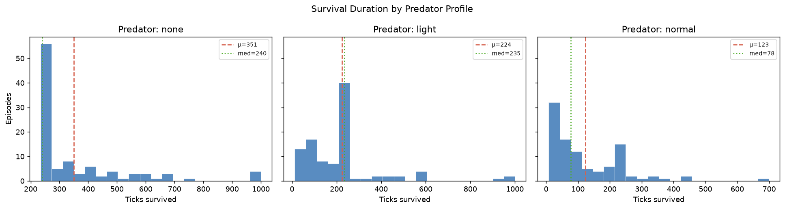
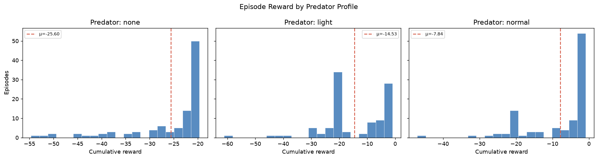
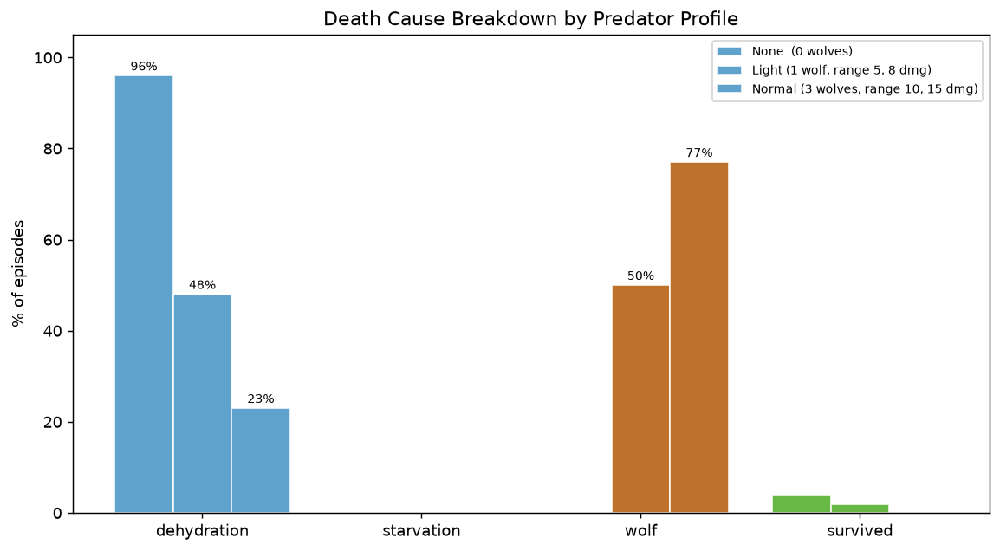
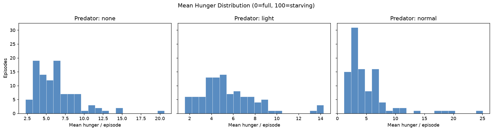
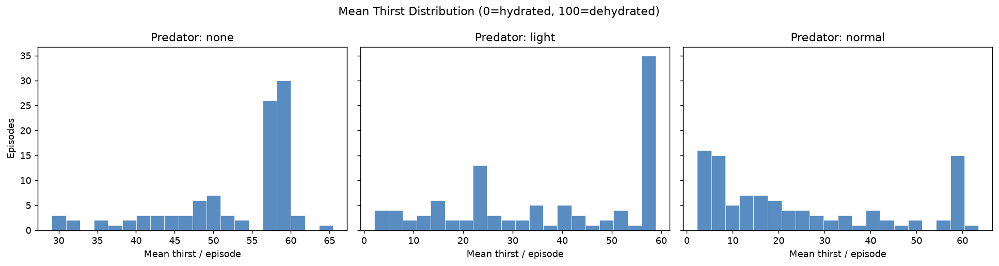
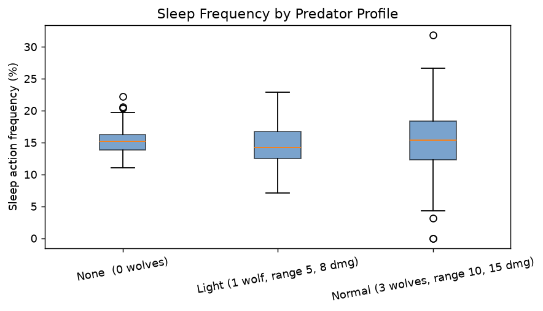
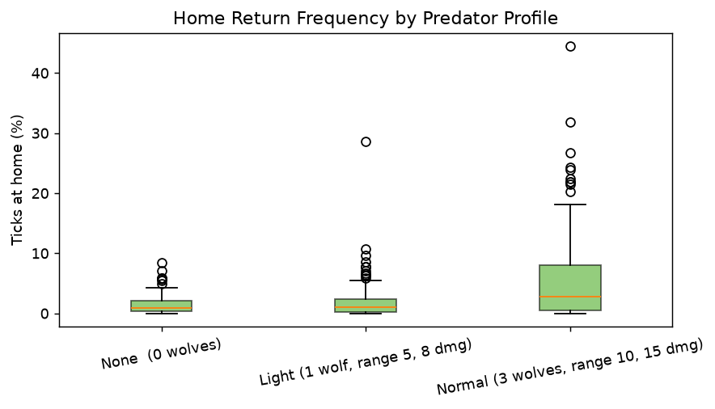
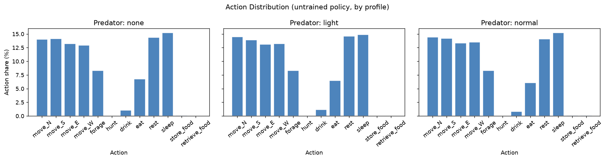

# V0 Baseline Evaluation Report

**Date:** 2026-06-19 06:27 UTC  
**Policy:** untrained AgentBrain (random initialisation, action mask active)  
**Episodes per profile:** 100  
**Max steps / episode:** 1000  
**Profiles evaluated:** none, light, normal  
**Evaluation time:** 0s

---

## Survival Summary

| Profile | Mean ticks | Median | Min | Max | Survived (%) |
|---|---|---|---|---|---|
| none | 350.6 ± 184.0 | 240 | 235 | 1000 | 4/100 (4%) |
| light | 224.0 ± 182.4 | 235 | 12 | 1000 | 2/100 (2%) |
| normal | 122.9 ± 117.4 | 78 | 8 | 699 | 0/100 (0%) |

## Episode Reward

| Profile | Mean | Std | Min | Max |
|---|---|---|---|---|
| none | -25.599 | 8.222 | -54.676 | -19.656 |
| light | -14.526 | 11.392 | -61.126 | -0.945 |
| normal | -7.843 | 9.239 | -47.079 | -0.907 |

## Deaths by Cause

| Profile | Dehydration | Starvation | Wolf | Survived |
|---|---|---|---|---|
| none | 96 (96%) | 0 (0%) | 0 (0%) | 4 (4%) |
| light | 48 (48%) | 0 (0%) | 50 (50%) | 2 (2%) |
| normal | 23 (23%) | 0 (0%) | 77 (77%) | 0 (0%) |

## Hunger Distribution

| Profile | Mean hunger | Episodes hitting max |
|---|---|---|
| none | 6.40 ± 2.98  [min 2.28, max 20.59] | 0/100 |
| light | 5.54 ± 2.61  [min 1.56, max 14.29] | 0/100 |
| normal | 5.13 ± 3.89  [min 1.16, max 25.07] | 0/100 |

## Thirst Distribution

| Profile | Mean thirst | Episodes hitting max |
|---|---|---|
| none | 52.69 ± 8.27  [min 29.12, max 65.46] | 98/100 |
| light | 37.40 ± 19.00  [min 2.12, max 58.88] | 51/100 |
| normal | 24.49 ± 19.73  [min 2.25, max 63.48] | 23/100 |

## Behaviour Frequencies

| Profile | Sleep (%) | At home (%) |
|---|---|---|
| none | 15.2 ± 2.1 | 1.4 ± 1.7 |
| light | 14.4 ± 3.2 | 2.2 ± 3.6 |
| normal | 15.0 ± 5.3 | 5.8 ± 8.1 |

## Plots

---

## Interpretation

**`none` profile**: 0/100 wolf kills, 96/100 dehydration, 0/100 starvation. Without wolves, the agent dies on its own schedule — confirming that thirst (200-tick TTD) is the primary environmental threat.

**`normal` profile**: 77/100 wolf kills confirm wolves dominate episode outcomes, masking thirst/hunger signals completely.  The random policy never develops avoidance so mean survival stays near 123 ticks.

**`light` profile**: 50/100 wolf kills, 48/100 dehydration. Mean survival 224 ticks — wolves are present but no longer dominant, allowing thirst and starvation signals to appear in training data.

**Training recommendation**: Start with `predator_curriculum_phase: light` so the
policy sees wolf threat without being overwhelmed.  Once mean survival exceeds
~300 ticks on `light`, advance to `normal` to introduce full ecological pressure.
The `none` profile is useful for isolating hunger/thirst learning without predator
interference during early curriculum phases.

**What the trained policy must learn (priority order):**
1. `light` / `none`: drink water when thirsty — prevents dehydration deaths
2. `light` / `none`: forage and eat — prevents starvation
3. `light`: avoid or flee single wolves — extends survival significantly
4. `normal`: navigate multi-wolf pressure, use home safety, sleep carefully