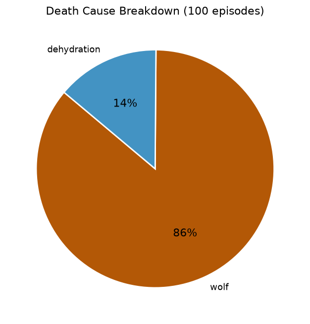

# V0 Baseline Evaluation Report

**Date:** 2026-06-19 05:54 UTC  
**Policy:** untrained AgentBrain (random initialisation, action mask active)  
**Episodes:** 100 seeds (0–99)  
**Max steps / episode:** 1000  
**Evaluation time:** 53s

---

## Survival Summary

| Metric | Value |
|---|---|
| Episodes survived to max_steps | 0/100 (0%) |
| Mean survival ticks | 116.2 ± 123.6 |
| Median survival ticks | 75 |
| Min / Max survival | 11 / 640 |

## Episode Reward

| Metric | Value |
|---|---|
| Mean reward | -6.495 |
| Std reward | 7.736 |
| Min / Max reward | -35.435 / -0.841 |

## Deaths by Cause

| Cause | Count | % |
|---|---|---|
| dehydration | 14 | 14% |
| starvation | 0 | 0% |
| wolf | 86 | 86% |
| survived | 0 | 0% |

## Hunger Distribution

| Metric | Value |
|---|---|
| Mean hunger (per episode mean) | 5.11 ± 3.62  [min 1.11, max 22.80] |
| % episodes reaching max hunger | 0/100 |

## Thirst Distribution

| Metric | Value |
|---|---|
| Mean thirst (per episode mean) | 21.77 ± 17.84  [min 1.91, max 58.54] |
| % episodes reaching max thirst | 14/100 |

## Behaviour Frequency

| Behaviour | Mean % of ticks | Std |
|---|---|---|
| Sleep action used | 16.1% | ±5.9% |
| Ticks spent at home | 4.5% | ±7.4% |

## Action Distribution

| Rank | Action | Share |
|---|---|---|
| 1 | sleep | 15.2% |
| 2 | rest | 14.5% |
| 3 | move_N | 14.5% |
| 4 | move_S | 13.8% |
| 5 | move_E | 13.2% |

## Plots

---

## Interpretation

The untrained policy's action distribution reflects **random exploration constrained
by the action mask** rather than any learned survival strategy.  Key observations:

- **Survival rate** of 0/100 (0%) at 1000 ticks indicates
  whether random valid actions alone are sufficient for near-term survival.
- **Dominant death cause** (wolf) tells us which threat the policy
  must first learn to manage.
- **Mean thirst** and **mean hunger** at episode end show how quickly stats
  saturate under a random policy.
- **Sleep frequency** and **home frequency** near zero would confirm that
  safe-rest and home-return behaviours are not yet emergent.

A trained policy should show: reduced deaths by dehydration/starvation,
higher survival ticks, non-random action distribution (DRINK, EAT, FORAGE
over-represented relative to their mask availability), and measurable home
frequency indicating learned navigation.